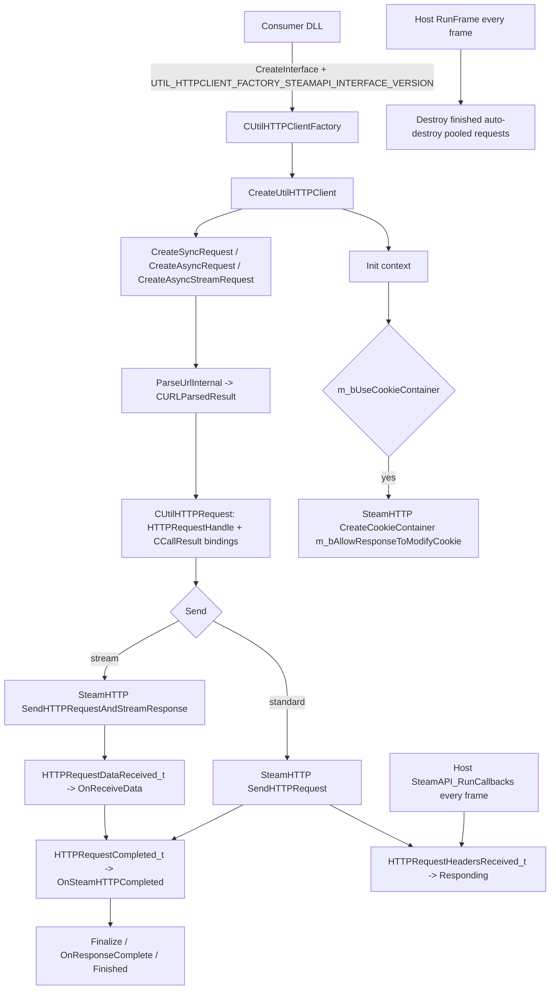

# UtilHTTPClient_SteamAPI

UtilHTTPClient_SteamAPI is a standalone HTTP client DLL backed by Steamworks `ISteamHTTP`. It
implements the shared `IUtilHTTPClient` API and provides synchronous, asynchronous and streamed
requests to the host application, which is how consumers get HTTP support without a general-purpose
network stack.

## Provenance

This repository is the standalone UtilHTTPClient_SteamAPI library, extracted from MetaHookSv
(`PluginLibs/UtilHTTPClient_SteamAPI/`) into its own CMake workspace, aligned with the standalone
Renderer, PrecacheManager and HeapPatch projects. This note was migrated from MetaHookSv
`memory/UtilHTTPClient_Steam.md` (whose title names the backend rather than the directory) and
adapted to the new layout: the implementation moved to `src/`, the original MSBuild project was
replaced by CMake with a pinned MetaHook SDK and ScopeExit plus the `thirdparty/SteamSDK` submodule,
and the upstream consumer in MetaHookSv has a standalone counterpart in the SCModelDownloader
repository. The `metahooksv` Basic Memory project belongs to the source repository; notes here use
the `utilhttpclient-steamapi` project and the `utilhttpclient-steamapi/` permalink prefix.

## Responsibilities and entry points

- `src/UtilHTTPClient_SteamAPI.cpp`: the entire implementation — the request family, the Steam HTTP
  plumbing and the request pool.
- `src/dllmain.cpp`: no-op DLL entry point.
- `include/Interface/IUtilHTTPClient.h`: the shared public contract (`IUtilHTTPClient`,
  `IUtilHTTPRequest`, `IUtilHTTPResponse`, `IUtilHTTPCallbacks`, `IURLParsedResult`,
  `CUtilHTTPClientCreationContext`, `UtilHTTPMethod`, `UtilHTTPRequestState`) and the version macros.
- `tests/SmokeTests.cpp`: tests that load the real DLL, obtain its factory and exercise the public
  behavior.

Exported interfaces:

| Export | Version string | Macro |
| --- | --- | --- |
| `EXPOSE_INTERFACE(CUtilHTTPClient, IUtilHTTPClient, ...)` | `UtilHTTPClient_SteamAPI_007` | `UTIL_HTTPCLIENT_STEAMAPI_INTERFACE_VERSION` |
| `EXPOSE_SINGLE_INTERFACE(CUtilHTTPClientFactory, IUtilHTTPClientFactory, ...)` | `UtilHTTPClientFactory_SteamAPI_007` | `UTIL_HTTPCLIENT_FACTORY_STEAMAPI_INTERFACE_VERSION` |

The public header declares both the SteamAPI and the libcurl version strings, so the same header
serves both backends; the two repositories ship slightly different copies.

## Architecture



Implementation layers (all in `src/UtilHTTPClient_SteamAPI.cpp`):

- **Client**: `CUtilHTTPClient` optionally creates an `HTTPCookieContainerHandle` during `Init`
  (`context->m_bUseCookieContainer`, with `m_bAllowResponseToModifyCookie` forwarded) and owns the
  request pool. Its `RunFrame()` does **not** pump Steam; it only walks the pool and destroys +
  erases requests that are `IsFinished()` and `IsAutoDestroyOnFinish()`.
- **Request family**: `CUtilHTTPRequest` holds the `HTTPRequestHandle` and the Steam `CCallResult`
  objects; its destructor cancels the `CallResult`, calls `ReleaseHTTPRequest` and then
  `m_Callbacks->Destroy()`. `CUtilHTTPSyncRequest` waits on a condition variable signalled by
  `OnSteamHTTPCompleted`; `CUtilHTTPAsyncRequest` defaults to auto-destroy and stubs the waiting
  API; `CUtilHTTPAsyncStreamRequest` uses `SendHTTPRequestAndStreamResponse` and forwards each
  chunk from `HTTPRequestDataReceived_t` to `OnReceiveData`.
- **Response family**: `CUtilHTTPResponse` wraps the status code, a cached header map and the
  payload; `CUtilHTTPPayload` reads the complete body for non-streaming requests, and the streaming
  path exposes chunks as they arrive.
- **Helpers**: `UTIL_ConvertUtilHTTPMethodToSteamHTTPMethod` maps `UtilHTTPMethod` to `EHTTPMethod`,
  and `ParseUrlInternal()` returns a `CURLParsedResult` (`IURLParsedResult`) with
  scheme/host/port/target/secure.

Behaviour worth knowing:

- `Send()` issues `SteamHTTP()->SendHTTPRequest` and binds the header-received and completion
  `CCallResult`s; it reports the `Requesting` state immediately. The streaming variant binds
  `HTTPRequestHeadersReceived_t` (state `Responding`), `HTTPRequestDataReceived_t` (chunk callback)
  and `HTTPRequestCompleted_t` (completion).
- The default `User-Agent` is a hard-coded Chrome UA; servers with UA-dependent policies need
  `SetField`.
- Certificate verification is configurable per request (`SetRequireCertVerification`), and header,
  body and timeout configuration map onto the Steam HTTP setters.

## Dependencies

- **Steamworks SDK**: `include/SteamSDK` and `steam_api.lib` from the `thirdparty/SteamSDK` git
  submodule; the CMake target `SteamSDK::SteamAPI` is imported as a shared library and its runtime
  DLL is installed at the archive root. The code depends on `steam_api.h`, `SteamHTTP()` and
  `CCallResult<...>`.
- **MetaHook SDK**: the interface base and factory macros; `include/HLSDK/common/interface.cpp` is
  compiled into this DLL, so no host launcher is built or required.
- **ScopeExit**: header-only RAII.
- **Build-only inputs, all read-only**: `METAHOOK_SOURCE_PATH`, `SCOPEEXIT_SOURCE_PATH` and
  `VC_LTL_Root` (SHA-256-verified VC-LTL 5.3.1 in `thirdparty/cache`). C++20, static MSVC CRT,
  Windows x86 only.
- **Runtime host requirements**: the host must have initialized Steamworks and must keep dispatching
  Steam callbacks (`SteamAPI_RunCallbacks()`); deploy the bundled `steam_api.dll` next to the game
  executable when the host does not already supply a compatible runtime.
- **No game integration**: the library uses no engine gamedata and needs no `plugins.lst` entry —
  consumers load it through `CreateInterface`.

## Repository layout

- `src/UtilHTTPClient_SteamAPI.cpp`, `src/dllmain.cpp` — implementation and entry point.
- `include/Interface/IUtilHTTPClient.h` — public header, installed for consumers.
- `tests/SmokeTests.cpp` — DLL factory and public-behavior smoke tests (CTest).
- `CMakeLists.txt`, `cmake/` — build and dependency setup, including the `SteamSDK::SteamAPI`
  imported target.
- `thirdparty/SteamSDK` — the Steamworks SDK submodule (`--recurse-submodules` on clone).
- `scripts/build-UtilHTTPClient_SteamAPI-x86-{Debug,Release}.bat` — configure/build/test/install
  entry points.
- `README.md`, `README.zh-CN.md`, `licenses/` — documentation and third-party terms.

## Build and data flow

`scripts/build-UtilHTTPClient_SteamAPI-x86-{Debug,Release}.bat` configures, builds, runs CTest and
installs into `install/x86/<Configuration>/`, stopping on failure; `BUILD_TESTING` defaults to `ON`
(`-DBUILD_TESTING=OFF` for a library-only build). Besides the SteamSDK submodule, the first
configure fetches the MetaHook SDK and ScopeExit at pinned commits unless the
`METAHOOK_SOURCE_PATH` / `SCOPEEXIT_SOURCE_PATH` / `VC_LTL_Root` overrides are supplied for offline
builds.
Install output is `install/x86/<Configuration>/`:

```text
steam_api.dll                                 (SteamSDK runtime, next to the game executable)
svencoop/metahook/dlls/UtilHTTPClient_SteamAPI.dll + .pdb
include/Interface/IUtilHTTPClient.h
include/HLSDK/common/interface.h
```

Nothing is deployed into a game automatically.

## Notes

- `SetFollowLocation()` is not implemented by this backend — the override body is empty, because
  Steam's HTTP API has no equivalent. Redirect handling therefore depends on the server or the
  caller.
- `CUtilHTTPResponse::GetResponseErrorMessage()` returns `m_ResponseErrorMessage`, which is never
  populated, so the message is always empty. Diagnose failures through `IsResponseError()`,
  `IsRequestSuccessful()` and `GetStatusCode()`; Steam provides no error detail.
- A synchronous wait depends on the Steam callback pump: if the host stops calling
  `SteamAPI_RunCallbacks()`, `WaitForComplete()` can block forever. Another thread must keep pumping,
  or the caller must poll `IsFinished()`.
- `CUtilHTTPAsyncRequest::WaitForComplete()` / `WaitForCompleteTimeout()` are stubs and
  `GetResponse()` returns `nullptr`; asynchronous requests must consume results through callbacks.
  The same callback-ownership rule as in the libcurl backend applies: the request destructor calls
  `m_Callbacks->Destroy()`, so callbacks must be heap objects that delete themselves.
- `RunFrame()` is only a pool janitor here — unlike the libcurl backend it performs no I/O, because
  Steam drives transfers through its own callbacks.
- The library is stateless with respect to the engine: no gamedata, no hooks, no export-table
  takeover.

## Callers (optional)

- The SCModelDownloader plugin prefers `UtilHTTPClient_libcurl.dll` and falls back to
  `UtilHTTPClient_SteamAPI.dll`, obtaining the factory by version string and driving
  `RunFrame()` from `HUD_Frame` (while the host's Steam callback pump keeps running).
- Any Steam-hosted module can use the same factory/`Init`/`RunFrame` contract when libcurl is not
  available or not wanted.

## External documentation

`README.md` is the English landing page and `README.zh-CN.md` the Chinese one; both cover the quick
start, the build overrides and the backend limitation. Dependency terms are documented in the
upstream repositories and under `licenses/`.
